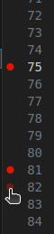

\page md_DEBUG Development Guide

# 🎯 Debugging with CMake and Visual Studio Code

Hey there, C++ developer! Ready to dive into debugging your code like a pro? Let’s make this process smooth and (dare I say) fun with CMake and Visual Studio Code. No stress—just follow along, and you’ll be debugging in no time!

## 🚀 Quick Setup Guide

1. **Open Your Project in a Devcontainer**  
   First things first: grab the _Dev Containers_ extension from the VSCode marketplace. Done? Awesome! Now hit `CTRL + SHIFT + P`, search for `Dev Container: Rebuild Container`, and voilà—you’re good to go!

2. **Pick Your CMake Kit**  
   Don’t worry; VSCode has your back! When you first open the project, it’ll ask you to select a C++ toolchain (aka a CMake Kit).  
   Pro tip: Choose `/usr/bin/g++` or `/usr/bin/gcc`—these are your go-to safe options!

   |  | 
   |:--:| 
   | *Kit selection? Easy. Stick to `/usr/bin/g++` or `/usr/bin/gcc`.* |

3. **Configure and Build Like a Pro**  
   CMake will automatically configure things as needed. All you have to do is sit back, grab a coffee, and let it work its magic. Once that’s done, use the toolbar buttons to build and run your shiny new software.

   |  | 
   |:--:| 
   | *Toolbar = your best friend for building and running.* |

## 🛠️ Time to Debug!

Now that you’re all set up, let’s get cracking on debugging your C++ code. Ready? Let’s go!

1. **Set Some Breakpoints**  
   Want to pause your program and take a peek at what’s happening under the hood? Just click next to the line number, and bam—you’ve got yourself a breakpoint!

   |  | 
   |:--:| 
   | *Look for the red dot to set breakpoints like a boss.* |

2. **Switch to Debug Mode**  
   Debugging mode is your playground, but first, let’s compile your code with debug flags. Use the bottom toolbar to flip from Release to Debug mode. Remember: Debug is for squashing bugs, Release is for speed!

   |  | 
   |:--:| 
   | *Flip that switch to Debug mode when hunting bugs.* |

3. **Start Debugging**  
   It’s showtime! Click the debug icon in the toolbar, and watch as VSCode does all the heavy lifting—building and launching your code in debug mode.

   |  | 
   |:--:| 
   | *Hit that debug button and let's get cracking!* |

4. **Master the Debugging Controls**  
   Now the fun begins! Use the controls to step into, step over, and continue through your code. It’s like navigating through a choose-your-own-adventure book, except you get to catch bugs and optimize performance!

   

   - **Variables View**: Curious what’s going on inside your variables? Peek into the "Variables" view—it's like X-ray vision for your code.
   - **Call Stack View**: Wondering how you got here? The "Call Stack" is your map of all the function calls that led you to this point.
   - **Watchpoints**: Set a watchpoint and see exactly when a variable changes. It’s like having a detective on your code.
   - **Debug Console**: Need to test something on the fly? Jump into the Debug Console and run expressions like a wizard casting spells. 🧙‍♂️

## 🏁 Wrap-Up

See? Debugging doesn’t have to be painful. With CMakeTools and Visual Studio Code, it’s all about making things easier so you can focus on writing great code and, of course, solving puzzles along the way.

So, ready to dive back into your code? You’ve got this. Happy debugging! 🎉
