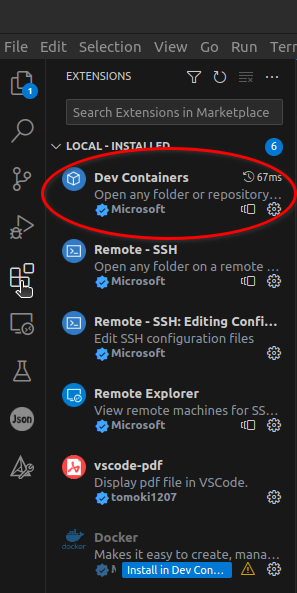
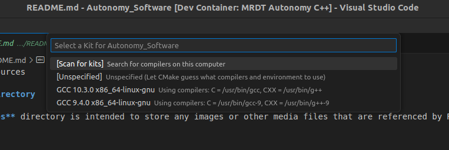
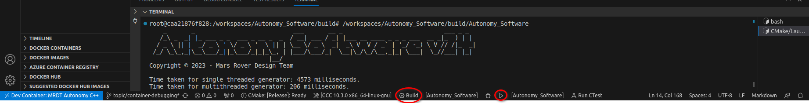

\page md_INSTALL Installation Guide

# Installing Autonomy Software

### 1. Download and Install Required Software:
    
- Download and install Visual Studio Code from [here](https://code.visualstudio.com/download)
- Download and install git-scm from [here](https://git-scm.com/downloads)
- Download and install Docker from [here](https://docs.docker.com/engine/install/) (NOTE: Only install Docker Desktop if you are on Windows! Only install Docker Engine for other OSs)

(Optional) Needed for container GPU support.
    - Download and install NVIDIA Container Toolkit from [here](https://docs.nvidia.com/datacenter/cloud-native/container-toolkit/latest/install-guide.html) This is only applicable if your machine has a GPU with CUDA. Windows users should integrate WSL (Windows Subsystem for Linux) into their Docker install. [Medium](https://medium.com/htc-research-engineering-blog/nvidia-docker-on-wsl2-f891dfe34ab) has an okay guide.

NOTE: For all installs, select the ADD TO PATH options whenever available.
   

### 2. Open VSCode and Install Extensions:

- Open VSCode and goto the extensions tab on the left toolbar.
- Use the searchbar to find the `Dev Containers` extension and click the install button.
- Feel free to install any other useful extensions that might help you develop your code.



NOTE: In the later steps when we start the devcontainer, It's extensions will be separate from the extensions locally installed on your computer. You can still install extensions to the devcontainer, but the extensions and their settings won't be persistent between container rebuild. If you would like an extension to come packaged in with the container, ask one of our [software leads](https://github.com/orgs/MissouriMRDT/teams/software_leads).

### 3. Clone the Autonomy_Software repo:
   
- Type the sequence `CTRL + SHIFT + P` to open the editor commands. 
- Then, start typing: 'git clone' and an option called `Git: Clone (Recursive)` will show up. Select that option and enter this URL when prompted: ```https://github.com/MissouriMRDT/Autonomy_Software.git```.
- Next, it will ask you where you want to store the repo files on your local machine. It's smart to store them in a organized folder structure located somewhere you won't forget and is that easily accessible.
- Finally, when the repo is done cloning, VSCode will ask you if you want to open the newly cloned workspace. Click 'open'.

### 4. Open the repo inside of our devcontainer:

All development for Autonomy_Software should be done using our custom made docker image. This image is specifically built so that it is compatible with our codebase. All linux packages, libraries, environment settings, and other configurations are baked into the image. So when you spin up a docker container from our image, it's guaranteed to work perfect and compile easy. This prevents everyone from spending hours trying to setup their environment on widely varying machines with different software and drivers.

- When the cloned folder is first opened, VSCode should detect that this repo is setup for a devcontainer and show a prompt. Click 'open'.
- If VSCode doesn't automatically ask to open the devcontainer, you can manually open it by typing `CTRL + SHIFT + P` and then finding and selecting the `Dev Containers: Rebuild Container` option.
    
    Give the container some time to install and setup extensions, you'll know it's done when the OUTPUT at the bottom stops printing.

### 5. First build and run:
- Once the devcontainer has been opened and extensions have been automatically setup, a box will appear asking you what CMAKE kit you want to compile with. Select the one that points to `/usr/bin/g++` and `/usr/bin/gcc`.
    
- If the CMake cache needs to be generated or updated, the extension will configure the project automatically. This process may take a few seconds, depending on your hardware. Use the build, run, and debug buttons to easily perform those actions.
    
- Normal make commands (such as `make clean`) can be performed by navigating into the `build/` directory with `cd build/` and running the desired commands.

### 6. Explore the different directories to understand the structure and purpose of each.
### 7. Refer to the specific README files within each directory for detailed information and guidelines on organizing files and using the functionalities.
### 8. Start developing!