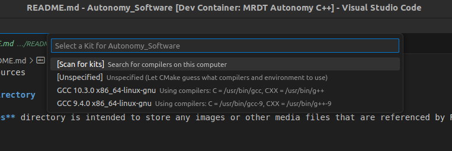
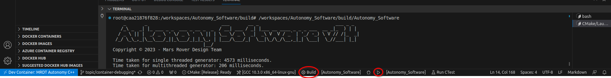

\mainpage

<div align="center">
  <a href="https://github.com/missourimrdt/autonomy_software">
    
  </a>
  <h1>Autonomy Software C++</h1>
  <p><b>Autonomous Traversal and Object Detection for Rovers in C++</b></p>
  <div>
    <a href="https://github.com/MissouriMRDT/Autonomy_Software/actions/workflows/codeql.yml">
      
    </a>
    <a href="https://github.com/MissouriMRDT/Autonomy_Software/actions/workflows/tests.yml">
      
    </a>
    <a href="https://github.com/MissouriMRDT/Autonomy_Software/actions/workflows/valgrind.yml">
      
    </a>
    <a href="https://github.com/MissouriMRDT/Autonomy_Software/actions/workflows/doxygen_generate.yml">
      
    </a>
  </div>
  <div>
    <a href="https://github.com/MissouriMRDT/Autonomy_Software/pkgs/container/autonomy-ubuntu20.04">
      
    </a>
    <a href="https://github.com/MissouriMRDT/Autonomy_Software/pkgs/container/autonomy-jetpack5.1">
      
    </a>
  </div>
  <div>
    <a href="https://www.gnu.org/licenses/gpl-3.0.en.html">
      
    </a>
    <a href="https://en.cppreference.com/w/cpp/20">
      
    </a>
  </div>
</div>
<br>

## Introduction

Welcome to the Autonomy Software repository of the Mars Rover Design Team (MRDT) at Missouri University of Science and Technology (Missouri S&T)! This repository contains the source code, documentation, and other resources for the development of the Autonomy Software for our Mars Rover. The Autonomy Software project aims to compete in the University Rover Challenge (URC) by demonstrating advanced autonomous capabilities and robust navigation algorithms.

### API Documentation
Everytime a commit is made to the development branch, a GitHub Action is ran that autonomatically generates documentation for files, classes, methods, functions, namespaces, etc. using Doxygen. To ensure that Doxygen can properly document and use your comments, make sure to use the documentation templates HERE. If you're running the development container in VSCode the templates can be automatically generated by typing `/**<enter>`. Regardless, all file, method, and function documentation must be use the template's style across the whole project.

#### [Autonomy_Software API Docs HERE](https://missourimrdt.github.io/Autonomy_Software/)


## Overview

The Autonomy Software project is organized into different directories, each serving a specific purpose. Here's a brief overview of the directories:

- **algorithms**: Contains C++ files related to the algorithms used in our Rover project. These files implement the core functionality and logic necessary for autonomous navigation, perception, and decision-making.

- **interfaces**: Contains C++ files related to the physical systems, boards, microcontrollers, or sensors on our Rover. These files handle the communication and interaction with external hardware components, ensuring seamless integration and data exchange.

- **states**: Contains C++ files related to the state machine code of our Rover. These files define the different states and transitions that govern the Rover's behavior, allowing for efficient task execution and adaptability to changing conditions.

- **util**: Contains utility scripts and helper functions used in our Rover project. These files provide various tools and functionalities to support development, debugging, and project management tasks, increasing overall efficiency and code reusability.

- **vision**: Contains C++ files related to vision processing or computer vision algorithms used in our Rover. These files enable the Rover to process visual data, such as images or videos, and extract meaningful information for autonomous navigation and object recognition.

- **tests**: Contains test cases and test scripts to ensure the correctness and reliability of our Autonomy Software. These files help validate the functionality and performance of our code, ensuring robustness and accuracy in real-world scenarios.

- **tools**: Contains files that provide utility scripts, development tools, or miscellaneous functionalities for our project. These files assist in various development tasks, such as data analysis, visualization, or simulation, enhancing the overall development experience.

- **external**: Contains external dependencies, libraries, or third-party modules used in our Rover project. These files are essential for the project's functionality and are organized based on their purpose or source, ensuring proper integration and compliance with licensing requirements.

- **examples**: Contains example code snippets, demos, or sample implementations related to our Rover project. These files showcase specific functionalities, best practices, or usage scenarios, helping us understand and leverage the capabilities of our Autonomy Software effectively.

- **docs**: Contains documentation files and resources for our Rover project. These files provide comprehensive and accessible documentation to guide developers, users, and contributors in understanding, configuring, and extending the Autonomy Software.

- **data**: Contains data files and resources used in our Rover project. These files include sensor data, training data, configuration files, map data, simulation data, and log files, facilitating the development, testing, and analysis of our autonomy algorithms.

The **src** directory serves as the main source code directory and contains the algorithms, interfaces, states, util, and vision directories mentioned above.

# Getting Started

### To get started with our Autonomy Software development, follow these steps:

#### 1. Download and install required software:
    
- Download and install Visual Studio Code from [here](https://code.visualstudio.com/download)
- Download and install git-scm from [here](https://git-scm.com/downloads)
- Download and install Docker from [here](https://docs.docker.com/get-docker/)

(Optional) Needed for container GPU support.
    - Download and install NVIDIA Container Toolkit from [here](https://docs.nvidia.com/datacenter/cloud-native/container-toolkit/latest/install-guide.html) This is only applicable if your machine has a GPU with CUDA. Windows users should integrate WSL (Windows Subsystem for Linux) into their Docker install. [Medium](https://medium.com/htc-research-engineering-blog/nvidia-docker-on-wsl2-f891dfe34ab) has an okay guide.

NOTE: For all installs, select the ADD TO PATH options whenever available.
   

#### 2. Open VSCode and install extensions:

- Open VSCode and goto the extensions tab on the left toolbar.
- Use the searchbar to find the `Dev Containers` extension and click the install button.
- Feel free to install any other useful extensions that might help you develop your code.


NOTE: In the later steps when we start the devcontainer, It's extensions will be seperate from the extensions locally installed on your computer. You can still install extensions to the devcontainer, but the extensions and their settings won't be persistant between container rebuild. If you would like an extension to come packaged in with the container, ask one of our [software leads](https://github.com/orgs/MissouriMRDT/teams/software_leads)

#### 3. Clone the Autonomy_Software repo:
   
- Type the sequence `CTRL + SHIFT + P` to open the editor commands. 
- Then, start typing: 'git clone' and an option called `Git: Clone (Recursive)` will show up. Select that option and enter this URL when prompted: ```https://github.com/MissouriMRDT/Autonomy_Software.git```.
- Next, it will ask you where you want to store the repo files on your local machine. It's smart to store them in a organized folder structure located somewhere you won't forget and is that easily accessible.
- Finally, when the repo is done cloning, VSCode will ask you if you want to open the newly cloned workspace. Click 'open'.

#### 4. Open the repo inside of our devcontainer:

All developement for Autonomy_Software should be done using our custom made docker image. This image is specifically built so that it is compatible with our codebase. All linux packages, libraries, environment settings, and other configurations are baked into the image. So when you spin up a docker container from our image, it's guarenteed to work perfect and compile easy. This prevents everyone from spending hours trying to setup their environment on widely varying machines with different software and drivers.

- When the cloned folder is first opened, VSCode should detect that this repo is setup for a devcontainer and show a prompt. Click 'open'.
- If VSCode doesn't automatically ask to open the devcontainer, you can manually open it by typing `CTRL + SHIFT + P` and then finding and selecting the `Dev Containers: Rebuild Container` option.
    
    Give the container some time to install and setup extensions, you'll know it's done when the OUTPUT at the buttom stops printing.

##### 5. First build and run:
- Once the devcontainer has been opened and extensions have been automatically setup, a box will appear asking you what CMAKE kit you want to compile with. Select the one that points to `/usr/bin/g++` and `/usr/bin/gcc`.
    
- If the CMake cache needs to be generated or updated, the extension will configure the project automatically. This process may take a few seconds, depending on your hardware. Use the build, run, and debug buttons to easily perform those actions.
    
- Normal make commands (such as `make clean`) can be performed by navigating into the `build/` directory with `cd build/` and running the desired commands.

#### 6. Explore the different directories to understand the structure and purpose of each.
#### 7. Refer to the specific README files within each directory for detailed information and guidelines on organizing files and using the functionalities.
### 8. Start developing!


# Debugging with CMake and Visual Studio Code

Debugging a C++ application in Visual Studio Code can be made seamless and efficient using the CMakeTools extension from Microsoft, which was automatically installed into the devcontainer from the Visual Studio Code Extensions Marketplace. This extension integrates CMake with Visual Studio Code, enabling developers to easily build and debug C++ applications directly within the VSCode environment.

## Setting up the Development Environment

1. Open this project in a devcontainer: First, install Microsoft's _Dev Containers_ extension from the marketplace. Then hit `CTRL + SHIFT + P` sequence
to open the editor commands, and select the `Dev Container: Rebuild Container` option. 

3. Select the CMake Kit: Once you open the project, you'll be prompted to select the CMake Kit for your project. You can do this either from the bottom status bar or during the initial setup of the development container a prompt will automatically show up. The CMake Kit represents the C++ toolchain used for building the project (compiler, architecture, etc.). Choose the appropriate kit for your project.

|  | 
|:--:| 
| *When the devcontainer is first started CMAKE Tools will ask you to select a kit. The compiler located at /usr/bin/g++ and /usr/bin/gcc will always be the safest choice.* |
|  |  
| *During subsequent startups, you can easily change the kit using the bottom toolbar.* |

4. Configure and build the project: If the CMake cache needs to be generated or updated, the extension will configure the project automatically. This process may take a few seconds, depending on your hardware.

|  | 
|:--:| 
| *Use the buttons in the toolbar to build and run the Autonomy_Software application.* |

## Debugging the C++ Application

Now that you have set up the development environment, you are ready to debug your C++ application.

1. Set Breakpoints: Place breakpoints in your C++ source code where you want to pause the program's execution to inspect variables, analyze the flow, or 
diagnose issues.

|  | 
|:--:| 
| *To set breakpoints directly within the vscode editor, toggle on the red dot next to the line numbers.* |

2. Compile for Debugging: In order to properly debug our application, we must compile the program with special flags set. We can let CMAKE do this for us by simply selecting the debug configuration from the bottom toolbar.

|  | 
|:--:| 
| *Use the toolbar to change between Release and Debug configurations. Release runs faster but can't be debugged, so whenever you're done debugging switch back to the Release config.* |

3. Start Debugging: Click the debug icon in the toolbar to automatically build and start the program.

|  | 
|:--:| 
| *Click the debug button to enter debug mode in VSCode.* |

4. Debugging Controls: Use the debugging controls (e.g., step into, step over, continue, etc.) in the Debug toolbar to navigate through your code while inspecting variables, stack traces, and more.


- Inspect Variables: In the "Variables" view, you can inspect the current values of variables in your code during debugging.
- Analyze Call Stack: The "Call Stack" view provides a stack trace, helping you understand the flow of execution and identify the function calls that led to the current point in your code.
- Set Watchpoints: You can set watchpoints on specific variables to break execution when their values change.
- Debug Console: Use the Debug Console to execute custom expressions and commands during debugging.

With CMakeTools and Visual Studio Code, you can efficiently build and debug your C++ applications within the familiar and powerful VSCode environment. The seamless integration between CMake and Visual Studio Code makes it easier for C++ developers to focus on writing code and quickly diagnose and fix issues. Happy debugging!

