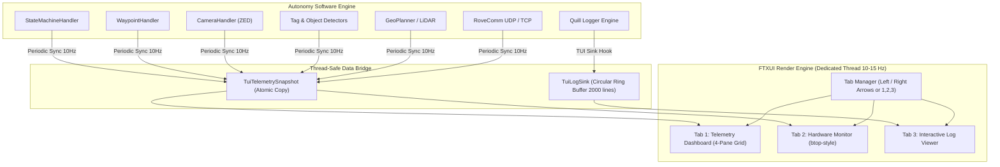

# Autonomy Terminal User Interface (TUI) Dashboard Design Specification

**Date:** 2026-09-21  
**Target Branch:** `feature/autonomy-tui-dashboard`  
**Status:** Approved  
**Author:** AI Pair Programmer & Autonomy Software Team  

---

## 1. Overview & Problem Statement

### 1.1 Context
During autonomous rover operations (University Rover Challenge / European Rover Challenge) and simulation testing with `RoveSoSimulator`, the `Autonomy_Software` process runs dozens of concurrent threads (ZED cameras, YOLO object detectors, ArUco tag detectors, GeoPlanner/LiDAR, State Machine, and RoveComm networking).

Currently, all subsystems stream log messages into standard output (`stdout`) via the Quill asynchronous logging engine. At operational rates (30–60 Hz), the terminal scrolls continuously at dozens of lines per second ("log vomit").

### 1.2 The Problem
1. **Critical Telemetry Loss**: Key operational numbers—such as UTM Easting/Northing coordinates, compass heading error, drive wheel power effort, camera FPS, and state machine transitions—flash past in milliseconds, making live monitoring difficult.
2. **Troubleshooting Hindrance**: When an anomaly occurs (e.g. waypoint deviation or dropped camera frames), operators cannot pause the stream or view previous warnings without stopping the rover or searching large log files on disk.
3. **Hardware Health Blindspot**: Operators currently need a separate terminal running tools like `btop` to observe CPU core loads, memory usage, Jetson GPU/DLA utilization, and temperatures.

### 1.3 Proposed Solution
Implement an integrated, high-performance, modular **Terminal User Interface (TUI)** inside `Autonomy_Software` using **FTXUI** (Functional Terminal User Interface for C++20). The TUI is opt-in via a `--tui` command-line argument, preserving 100% backward compatibility for standard headless/scripted executions.

---

## 2. Architecture & Design Principles



### 2.1 Core Architectural Principles
1. **Zero Impact on Autonomy**: The TUI runs on an independent, low-priority rendering thread at 10–15 Hz. Under no circumstances will TUI rendering, terminal scrolling, or user keyboard input block autonomous navigation, camera ingestion, or safety checks.
2. **100% Backward Compatibility**: Default execution (`./Autonomy_Software`) is completely unchanged. Quill logs continue streaming to `stdout` as before. `--tui` must be explicitly passed to enter full-screen TUI mode.
3. **Full Disk Log Preservation**: Quill rotating file sinks (`../logs/YYYY-MM-DD_HH-MM-SS/console_output`) continue writing at full fidelity regardless of whether the TUI is active.
4. **Terminal Hygiene & Crash Safety**: TUI uses the terminal's alternate screen buffer (`\033[?1049h`). RAII guards ensure that normal exits (`q`, `Ctrl+C`) or unhandled exceptions immediately restore the primary terminal screen and canonical settings, preventing terminal corruption.

---

## 3. Detailed Component Specifications

### 3.1 Library Integration: FTXUI
- **Dependency Management**: Integrated via CMake `FetchContent` (pointing to `ArthurSonzogni/FTXUI` v5.0.0).
- **Standards Compatibility**: C++20 standard, compiled cleanly with GCC 10 on Ubuntu/JetPack and x86_64 Linux.
- **Components Used**:
  - `ftxui::ScreenInteractive` (alternate buffer event loop)
  - `ftxui::Container::Tab` with `ftxui::Menu` (arrow key and numeric tab switching)
  - `ftxui::gauge`, `ftxui::color`, `ftxui::window`, `ftxui::vbox`, `ftxui::hbox` (responsive panel layout)

### 3.2 CLI Interface
- `main.cpp` checks command-line arguments:
  ```cpp
  bool bEnableTUI = false;
  for (int i = 1; i < argc; ++i)
  {
      if (std::string(argv[i]) == "--tui" || std::string(argv[i]) == "-tui")
      {
          bEnableTUI = true;
      }
  }
  ```
- If `bEnableTUI` is false, autonomy initializes the standard `ConsoleSink` and runs the existing `while(!bMainStop)` loop.
- If `bEnableTUI` is true, autonomy initializes `TuiLogSink` and spawns `TuiManager`.

### 3.3 Thread-Safe Data Model (`TuiTelemetrySnapshot`)
Located in `src/util/tui/TuiTelemetrySnapshot.h`:
```cpp
struct TuiTelemetrySnapshot
{
    // State Machine
    statemachine::State eCurrentState = statemachine::State::eIdle;
    int nCurrentWaypointID            = -1;
    std::string szStateDescription   = "System Idle";
    double dMissionUptimeSeconds      = 0.0;

    // Navigation & Rover Pose
    double dEasting                   = 0.0;
    double dNorthing                  = 0.0;
    double dAltitude                  = 0.0;
    double dCompassHeading            = 0.0;
    double dTargetHeading             = 0.0;
    double dHeadingError              = 0.0;
    double dDistanceToWaypoint        = 0.0;

    // Drive System
    float fLeftDrivePower             = 0.0f;
    float fRightDrivePower            = 0.0f;
    float fSlopeMultiplier            = 1.0f;
    float fPitchAngle                 = 0.0f;
    float fRollAngle                  = 0.0f;

    // Vision Pipeline
    float fMainCamFPS                 = 0.0f;
    float fRearCamFPS                 = 0.0f;
    int nDetectedTagsCount            = 0;
    int nBestTagID                    = -1;
    double dBestTagDistance           = 0.0;
    double dBestTagYaw                = 0.0;
    int nDetectedObjectsCount         = 0;
    std::string szBestObjectClass     = "None";
    float fBestObjectConfidence       = 0.0f;
    double dBestObjectDistance        = 0.0;

    // GeoPlanner & LiDAR
    bool bLidarDBLoaded               = false;
    std::string szLidarDBPath         = "";
    int nPlannedPathWaypoints         = 0;
    int nObstacleCount                = 0;
    int nCurrentTileX                 = 0;
    int nCurrentTileY                 = 0;

    // Network & Threads
    bool bRoveCommUDPOnline           = false;
    bool bRoveCommTCPOnline           = false;
    uint32_t nRoveCommUDPIPS          = 0;
    uint32_t nRoveCommTCPIPS          = 0;
    uint32_t nStateMachineIPS         = 0;
    uint32_t nVizClientCount          = 0;

    // Hardware Metrics
    float fCpuTotalUsage              = 0.0f;
    std::vector<float> vPerCoreUsage;
    float fRamUsedGB                  = 0.0f;
    float fRamTotalGB                 = 0.0f;
    float fGpuUsagePercent            = 0.0f;
    float fVramUsedGB                 = 0.0f;
    float fVramTotalGB                = 0.0f;
    float fCpuTempCelsius             = 0.0f;
    float fGpuTempCelsius             = 0.0f;
};
```

### 3.4 Custom Quill Log Interceptor (`TuiLogSink`)
Located in `src/util/tui/TuiLogSink.h`:
- Subclasses `quill::Sink`.
- Intercepts log lines produced by `LOG_DEBUG`, `LOG_INFO`, `LOG_NOTICE`, `LOG_WARNING`, `LOG_ERROR`, `LOG_CRITICAL`.
- Pushes entries into a circular ring buffer:
  ```cpp
  struct TuiLogEntry
  {
      std::string szTimestamp;
      quill::LogLevel eLevel;
      std::string szMessage;
  };
  ```
- Ring buffer capacity is 2,000 lines. When full, oldest entries are overwritten.
- Protected by a lightweight mutex or atomic ring pointers.

---

## 4. User Interface & Layout Specifications

### 4.1 Tab 1: Telemetry Dashboard (Modular Grid)
- **Top Mission Header**:
  - `STATE: <STATUS>` (Color-coded: Green = `NAVIGATING`, Yellow = `APPROACHING_MARKER`, Cyan = `IDLE`, Red = `FAULT`).
  - `SIM MODE: <ENABLED/DISABLED>` (Yellow badge when simulation mode active).
  - `UPTIME: HH:MM:SS`.
- **4-Pane Grid**:
  - **Pane 1 (Top-Left) — Nav & Pose**: Numerical UTM Easting/Northing, Compass Heading, Target Bearing, Heading Error gauge, and Left/Right wheel effort horizontal bars (`[████████░░░░] 65%`).
  - **Pane 2 (Top-Right) — Vision & Detectors**: Front & Rear ZED Camera FPS, detected ArUco tags (ID, distance, bearing), detected YOLO objects, IMU acceleration vector.
  - **Pane 3 (Bottom-Left) — GeoPlanner & LiDAR**: Database loaded status, tile coordinates, path length, active obstacle count.
  - **Pane 4 (Bottom-Right) — Network & Comms**: RoveComm UDP/TCP link statuses, packet rates, active thread IPS indicators.
- **Bottom Navigation Bar**:
  - Key legends: `[←/→] Tabs | [1/2/3] Jump | [Space] Pause Logs | [p] Dump Pose | [d] Dump Powers | [q] Quit`.

### 4.2 Tab 2: System Hardware Monitor (`btop` Inspired)
- **CPU Box**: Per-core utilization bar gauges (`C0` to `CN`) read from `/proc/stat`, total CPU utilization %, and average load.
- **GPU & Accelerators Box**: NVIDIA GPU load %, VRAM usage bar, Jetson DLA engine status, GPU temperature, and fan speed.
- **Memory & Thermals Box**: Host RAM usage (used/total), Swap usage, CPU core temperature, board temperature.

### 4.3 Tab 3: Dedicated Live Log Stream
- **Header Filter Bar**: Toggles for log level filtering:
  - `[1: ALL]` (Trace, Debug, Info, Notice, Warning, Error, Critical)
  - `[2: INFO+]` (Info, Notice, Warning, Error, Critical)
  - `[3: WARN+]` (Warning, Error, Critical)
  - `[4: ERROR ONLY]` (Error, Critical)
- **Interactive Features**:
  - `Spacebar`: Toggles auto-scroll pause. Freezes screen to allow careful reading of error traces while Autonomy continues running in the background.
  - `Up / Down / PageUp / PageDown`: Scrolls back through historical buffer.
  - `c`: Clears current view buffer.

### 4.4 Responsive Terminal Resizing
- FTXUI hooks `SIGWINCH`.
- **Large Viewport ($\ge 100$ columns)**: Full 2×2 grid layout.
- **Narrow Viewport ($< 100$ columns)**: Reflows dynamically into a stacked vertical layout with scroll support.
- **Compact Viewport ($< 24$ rows)**: Margins and decorative frames collapse automatically to maximize data visibility.

---

## 5. Error Handling & Safety

1. **Terminal Cleanup Guard (RAII)**:
   ```cpp
   class TerminalGuard
   {
   public:
       TerminalGuard() { std::cout << "\033[?1049h\033[?25l" << std::flush; }
       ~TerminalGuard() { std::cout << "\033[?25h\033[?1049l" << std::flush; ResetTerminalMode(); }
   };
   ```
   Ensures that whether the program terminates via `q`, `Ctrl+C`, `SIGTERM`, or an uncaught exception, the terminal is guaranteed to restore normal screen buffer and cursor visibility.
2. **Sensor & Metric Fallbacks**: If `/proc/stat` or NVML/sysfs is unavailable (e.g. running inside restricted container or Windows host), hardware queries return zero/unavailable without throwing exceptions or crashing.

---

## 6. Verification Plan

### 6.1 Automated Unit Tests
- `test/TuiRingBufferTest.cpp`: Tests concurrent push/pop, 2,000 line capacity wrap-around, and level filtering.
- `test/TuiTelemetrySnapshotTest.cpp`: Tests thread-safe telemetry reading/writing without data corruption.
- `test/SystemMetricsTest.cpp`: Tests CPU, RAM, and GPU parsers against missing files and malformed syntax.

### 6.2 Manual & System Verification
1. **CLI Regression**: Run `./Autonomy_Software` without `--tui` -> confirm existing stdout log behavior is identical.
2. **TUI Launch**: Run `./Autonomy_Software --tui` -> confirm alternate buffer opens, 3 tabs cycle via arrow keys.
3. **Live Sim Telemetry**: Run with `RoveSoSimulator` -> confirm live UTM coordinates, camera FPS, and drive powers update smoothly.
4. **Log Pause & Scroll**: Freeze logs with `Spacebar`, navigate with `PgUp`/`PgDn`, verify resumed streaming.
5. **Terminal Resize**: Drag terminal window down to 80×24 and up to full screen -> verify responsive reflow with zero crashes.
6. **Clean Exit**: Press `q` or `Ctrl+C` -> verify prompt restores cleanly.
